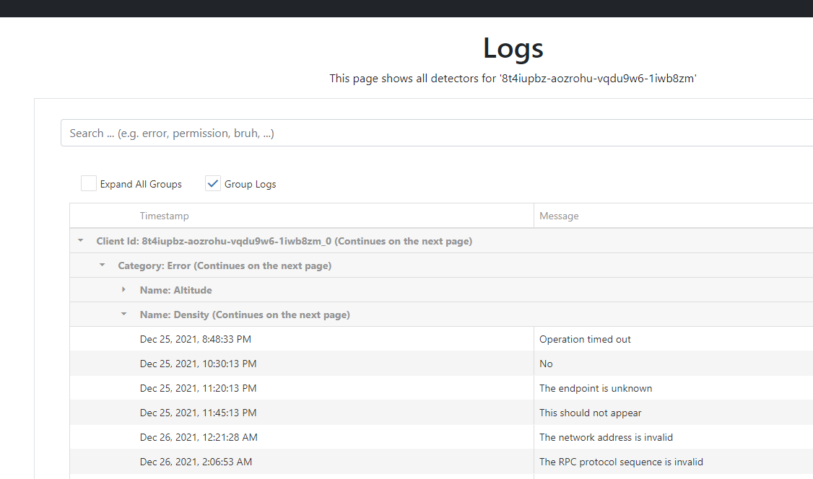
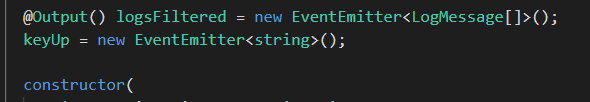
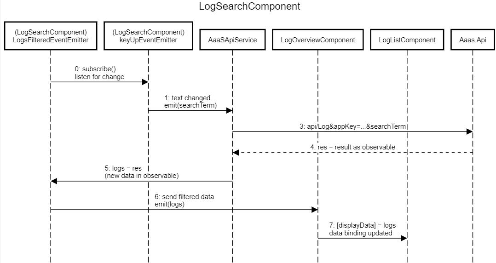

# aaas_web

## Project structure

Sources files in the folder `src` are structured in the following way:
* component: general purpose components that could be used anywhere; examples are `LoadingComponent` for indication async work, `ItemNotFoundComponent` when the requested resource could not reached or `LogSearchComponent`
* controller: components that are associated with a `route` in `app-rounting.module.ts`
* guard: handles who can access certain `routes`
* model: classes for displaying data (`Metric`, `Detector`, `Log`, `Action`, `ClientInstance`); strongly oriented by `DTOs` from `AaaS.Api.DTOs`
* pipe: custom pipes ()
* services: services
* util: utility classes and functions which may be used in different component
* validator: custom validators

Imports and components in `app.module.ts` have also been sorted into categories.

Most of the controls used come from [DevExtreme](https://js.devexpress.com/Overview/).
Often sample code from demos was sufficient but for more tricky stuff their [API reference](https://js.devexpress.com/Documentation/ApiReference/UI_Components/) was really helpful for implementing things like custom sorting behaviour for lists and grids, customizing charts, working with column templates and more.

## Install

Execute the following commands and gaze the progress bar for the next 3 minutes:

```cmd
npm install
ng serve
```

Make sure your application runs on port 4200, otherwise the identity provider will not authenticate you :(.

## OAuth

Manfred Steyer's identity server instance is used to log in.
The only page that is accessible without being logged in are `/home`.
Trying to access other pages redirects the user to the identity provider.
Having a login page that just tells the customer he has to log in seemed kind of pointless.
The user also has the option to log himself out.

## Architecture

The page consists of 4 main pages:

* `/home` with information about the site
* `/metrics` for metric analysis
* `/logs` for an overview of all logs and a search component `LogSearchComponent` which filters the list of logs
* detectors
    * `/detectors` for the list of detectors
    * `/detector/:id` for the detail view of a detector and
    * `/detectors/form` for editing/adding a new detector

Most calculation is done serverside (filtering of logs) but the client also has to perform some computation heavy work like sorting data and displaying charts.

## Metrics

This component consists of 2 `dx-lists` where the user can select the type of telemetric he wants to analyse (single choice) and the client instances for which `dx-chart`s should be generated.
All the data is requested from the api at once and grouped by client instances.
`Generate Charts` generates charts using the current selection.
The user can also change the representation of the charts with changing the selection in the  `dx-select-box` `Chart Mode`.
This can also be done with already generated charts.
The selection box also moves with the user when he scrolls down 
In order to lag when rendering many charts or many data points in a single chart, all data points are aggregated into one point every `25 pixels` in the x-axis.
The generates charts are also zoomed into the latest `50 data points` upon generation.
Users can zoom in and out of the data points and pan to earlier datapoints using their mouse/fingers.

## Logs

In order to maintain an overview over potentially millions of logs, they are not simply displayed in a list.
A `dx-data-grid` is used in which `LogMessage`s are grouped by some of their properties:



Additionally, log messages can be sorted by their message content and their timestamp (custom comparison needed here).
Above the `dx-data-grid` is a custom search component `LogSearchComponent` which takes any search term and sends a request to our API after a debouce time of `1000 ms`.
It emits an event `logsFiltered` of `LogMessage[]` for components which use this component.
The component/controller `LogOverviewComponent` uses `LogSearchComponent` and hands the filteres logs over to `LogListComponent` which takes `Metric[]` in `displayData` as input.



This process is described by the following sequence diagram:




## Detectors

## NgOnDestroy

In order to avoid memory leaks when using observables, the `NgOnDestroy` and `TakeUntil()` pattern is used.
At least I hope I didn't forget to do it somewhere :).