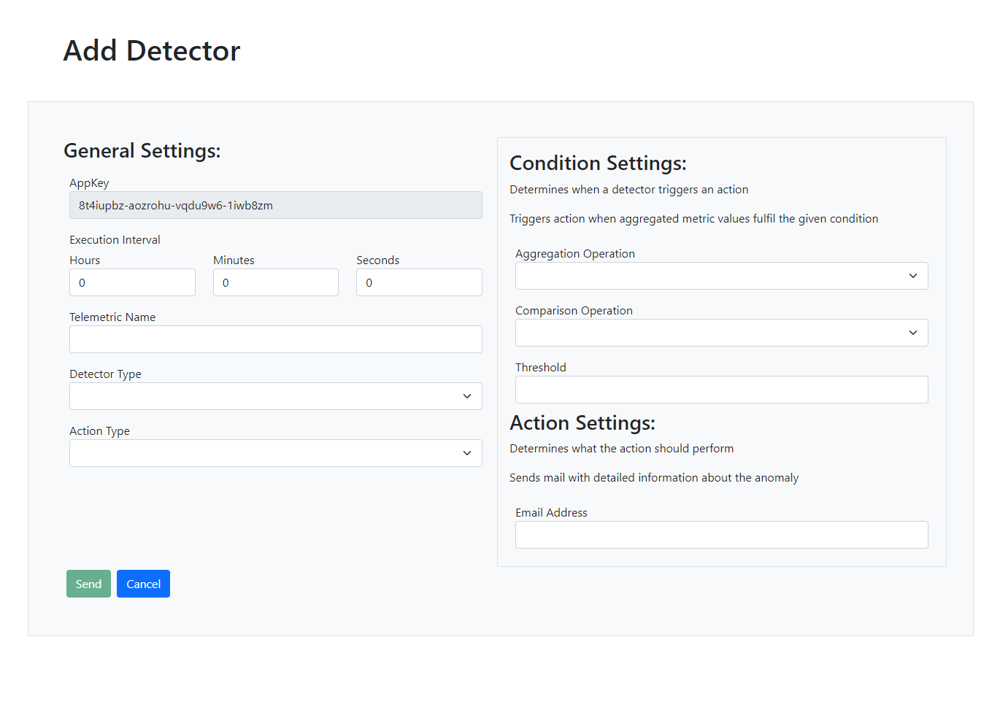

# aaas_web

## Project structure

Sources files in the folder `src` are structured in the following way:
* component: general purpose components that could be used anywhere; examples are `LoadingComponent` for indication async work, `ItemNotFoundComponent` when the requested resource could not reached or `LogSearchComponent`
* controller: components that are associated with a `route` in `app-rounting.module.ts`
* guard: handles who can access certain `routes`
* model: classes for displaying data (`Metric`, `Detector`, `Log`, `Action`, `ClientInstance`); strongly oriented by `DTOs` from `AaaS.Api.DTOs`
* pipe: custom pipes ()
* services: services
* util: utility classes and functions which may be used in different component
* validator: custom validators

Imports and components in `app.module.ts` have also been sorted into categories.

Most of the controls used come from [DevExtreme](https://js.devexpress.com/Overview/).
Often sample code from demos was sufficient but for more tricky stuff their [API reference](https://js.devexpress.com/Documentation/ApiReference/UI_Components/) was really helpful for implementing things like custom sorting behaviour for lists and grids, customizing charts, working with column templates and more.

## Install

Execute the following commands and gaze the progress bar for the next 3 minutes:

```cmd
npm install
ng serve
```

Make sure your application runs on port 4200, otherwise the identity provider will not authenticate you :(.

## OAuth

Manfred Steyer's identity server instance is used to log in.
The only page that is accessible without being logged in are `/home` and `/login`.
Trying to access other pages redirects the user to `/login`.
There is still a `/login` route which just tells the user that he is already logged in and offers him the option of loggin out.
The user also has the option to log himself out (top right or at `/login`).
Basic information from OIDC (given_name, last_name) is displayed at the navigation bar when logged in.

## AppKey

The user has to enter a valid app key in order to access pages other than `/home` and `/login`.
Naviation options are removed if the user has not entered a valid app key (AppKeyGuard).
Also images/gifs in `/home` `AppKeySelectComponent` when validation the app key :).

## Architecture

The page consists of 4 main pages:

* `/home` with information about the site and to enter your app key
* `/metrics` for metric analysis
* `/logs` for an overview of all logs and a search component `LogSearchComponent` which filters the list of logs
* detectors
    * `/detectors` for the list of detectors
    * `/detector/:id` for the detail view of a detector and
    * `/detectors/form` for editing/adding a new detector

Most calculation is done serverside (filtering of logs) but the client also has to perform some computation heavy work like sorting data and displaying charts.

## Metrics

This component consists of 2 `dx-lists` where the user can select the type of telemetric he wants to analyse (single choice) and the client instances for which `dx-chart`s should be generated.
All the data is requested from the api at once and grouped by client instances.
`Generate Charts` generates charts using the current selection.
The user can also change the representation of the charts with changing the selection in the selection box `Chart Mode`.
This can also be done with already generated charts.
The entire left bar with all the settings moves with the screen when scrolling down.
In order to prevent lag when rendering many charts or many data points in a single chart, charts also zoomed into the latest `50 data points` upon generation.
Users can zoom in and out of the data points and pan to earlier datapoints using their mouse/fingers.


## Logs

In order to maintain an overview over potentially millions of logs, they are not simply displayed in a list.
A `dx-data-grid` is used in which `LogMessage`s are grouped by some of their properties:


Additionally, log messages can be sorted by their message content and their timestamp (custom comparison needed here).
Above the `dx-data-grid` is a custom search component `LogSearchComponent` which takes any search term and sends a request to our API after a debouce time of `1000 ms`.
It emits an event `logsFiltered` of `LogMessage[]` for components which use this component.
The component/controller `LogOverviewComponent` uses `LogSearchComponent` and hands the filteres logs over to `LogListComponent` which takes `Metric[]` in `displayData` as input.


This process is described by the following sequence diagram:


## Detectors

Detectors are displayed in a list.
This list can be sorted and filtered.

The list offers basic information about a detector and each entry has a detail button.


### Form

Reactive form with custom validation and a lot of subscriptions.
When editing, you cannot change the telemetric name and actionType/detectorType since this is not supported by the AaaS backend.
The appkey is also not modifyable but is displayed anyways.
Telemetric name is also displayed as readonly when editing the detector.
`executionInterval` is split into 3 controls (hours, seconods, minutes).


Edit and Add of detectors use the same form, edit form is already populated with data from selected detector.



Attempting to add a detector for a telemetric name which already exists for this app key creates a button which takes you to this detector.


You can also delete the detector in the edit form.
You cannot enable/disable detectors in the form as this is done in the detail page.

### switching between components

Problem: Form needs different controls depending on selected types (detectorType, actionType).
My solution: have separate components for these form groups and enabled them depending on which one is needed; the main form defines possible controls like a union data type

Using reactive forms, the reference to the main form is passed to each of those components.
In order to make this approach remotely scalable, the parent does not tell each child to activate themselves.
All child component selectors are placed in the html where they should appear.
To make sure the parent does not have to deal with the logic in order to enable/disable those components, the child components do this themselves.

A custom service `typeChangedService` is used which manages observable Subjects `actionTypeChanged` and `detectorTypeChanged`.
Whenever the selected type of detector/action is changed, the coresponding subject is modified.
Child components subscribe to their `typeChanged...` subject and listed to changes and enabled themselves/add their validators.

The following diagram visualizes this (activation of `MinMaxDetectorComponent`).


### Form Validation

Validators are defined in the components that deal with those controls.
The main form `detectorForm` speficies validators for these static controls.
The child comonents remove their validators when not needed and add them back when they become enabled using the reference to the parent form.

Custom validators:
* TypeMustExistValidator: attached to a control and takes an `string[]`; whenever the values is changed, the values has to exist in the given `string[]`; used for the select box for detectorType/actionType in case someone goes into f12 and edits the values :(
* TotalDurationMoreThanOneSecond: checks if total time in controls for execution interval add up to at least one second. this is attached to a all 3 controls so an error can be printed; you have 
* CheckIfMinValueNotLargerThanMaxValue: value of control `minValue` cannot be larger than `maxValue`; is attached to `minValue` so an error can be printed; listener to `maxValue` added which checks if values are valid again in case only `maxValue ` changes would result in a valid value (otherwise dirty flag in `minValue` will not get cleared when).


## Form submission

Custom logic is needed here since the control names do not match with the properties of `Detector`.
We need to create an `Action` from the form values and add is to the detector.

### Details

The detail page just displays properties of the detector.
Here you can also toggle detectors activation status when pressing the green/red button.
In order to distinguish between differen detector types, `ngSwtitch` is used in conjunction with a detectors `type` and their actions `type` to display different components which deal with displaying this information.
The detail page also uses two custom pipes in order to format property values.

* IntervalToReadableTimePipe: converts milliseconds to `00h 00m 00s` format; also used in `DetectorListComponent`
* WordToComparisonOpPipe: converts string representation of enum for `comparisonOp` like `greater` to signs like `>`.

## Services

Auth service deals with authentication and can provide user specific data via OIDC.

The `AaaSApiService` has two different purposes:
* offer functions for api calls
* manage the currently active app key and notify subscribers if it has changed

The currently used app key is persisted in the local storage (which is bad and insecure) and is read from local storage upon first starting the application.
Reloading the page also triggers attempting to read the app key from local storage.
`AaaSApiService` offers Observable Subjects for the currently available app key and if it is valid or not.
These are `ReplayObservables` to make sure components have access to an app key when they first subscribe to it.

```ts
    appKeyStatus: ReplaySubject<string> = new ReplaySubject<string>(1);
    appKeyAccepted: ReplaySubject<boolean> = new ReplaySubject<boolean>(1);
```

Attempting to update the app key in `/home` `AppKeySelectComponent` updates `appKeyAccepted`.
`appKeyStatus` distributes the new app key if the entered app key was valid.

## Guards

### CanUseClientGuard

Makes sure the user is logged in with OAuth.
It offers an observable subject `loginStatus` for the current login status.
Redirect to `/home` in case not logged in.

### AppKeyGuard

Makes sure the user has entered an app key before accessing any other routes besides `/home` and `/login`.
Redirects to `/home` if no app key was found.`
Subscribes to `appKeyAccepted` from `AaaSApiService` to check if a valid app key is in use.

## NgOnDestroy

In order to avoid memory leaks when using observables, the `NgOnDestroy` and `TakeUntil()` pattern is used.
At least I hope I didn't forget to do it somewhere :).

## Error handling

Errors that occur when communication with `AaaS.Api` are handled.
Whenever communication is attempted with `AaaS.Api`, it could not work due to an error (no connection/server down/...).
When data is requested, it returns the object/an array of objects when the api call worked or returns `null` in case of a failure;
When data is modified (put, post, delete), it returns a boolean (`true` for success, `false` for failure).
Failures are checked and messages displayed/controls removed when the connection could not have been established.